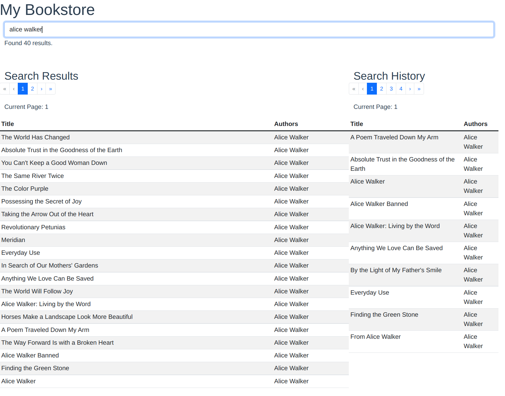
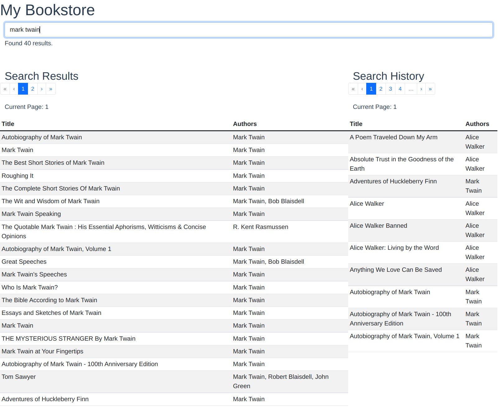
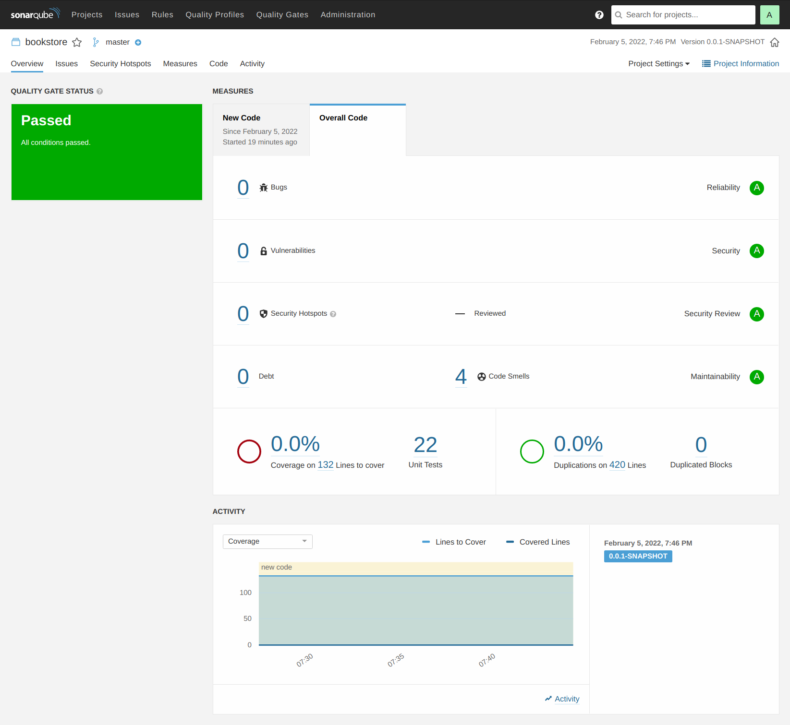

# Run Locally
```
# adjust log location if needed 
# /data/logs/bookstore.json.log
 
# back end (Java 8)
# at project directory
./gradlew clean build bootRun

# run at localhost:8080


# front end (node 17.3.0, npm 8.3.1)
# download from https://nodejs.org/dist/v17.3.0/
# at project directory
cd front-end/client
npm install
npm run serve

# then open http://localhost:8081/ in browser
```

# Process
- get understanding about the requirements
- reach out to clarify ambiguity (ideally, we should clarify it before implementing the solution) 
  - user story #1 
    - it's saying to display the first 50 matches, but the google book api is only returning 40 results per call, 
      try to clarify if 2 calls should be made to get 50 matches; this requirement is also conflicting with bonus 
      requirements "show 20 results at a time using pagination", so I go with 1 api call
  - user story #2 
    - didn't mention the ordering preference, so for simplicity I go with order by title
    - didn't mention how many search histories to retain and based on what criteria to retain the histories, 
      so I go with first 100 order by title
- try out the Google Books API via curl
- design the rest api's contract and domain models
- implement the solution and unit tests code

# Additional Assumption
- application does not require authentication, so using [FingerprintJS](https://github.com/fingerprintjs/fingerprintjs) to identify users

# Production Rollout
- identify the architecture, e.g.
  - single app deployment vs separate front end, backend
  - use of data store (i.e. external cache, distributed cache, database)
  - high availability, load balancing
  - observability (app logs/metrics, system metrics)
  - security
- resolve the cross origin issue

# TODO
- setup Jenkins pipeline to automate the build/release
- replace SonarQube `sonar.host.url` to company's SonarQube URL

# IntelliJ Notes
To run in IntelliJ, please
- enable annotation processing
- click `Build` > `Build Project` ( `Ctrl-9` ) to generate the [Immutables](https://immutables.github.io) classes 

# Screen Capture
Search - alice walker


Search - mark twain


SonarQube


